DSIA-5102A : Application Full Stack Data
==========================================
**Développé par Xianli LI et Céline SISAVANH**

Dans le cadre de l'unité DSIA-5102A de 5ème année à l'ESIEE Paris, nous devons créer une application web en réfléchissant à l'utilité du produit.
Pour cela, nous devons décorréler la partie backend de l'application du frontend de celle-ci. Nous avons donc créer deux sous projets de l'application avec deux technologies différentes : 

- backend : FastApi
- frontend : React

Nous avons donc décidé de créer une application de e-commerce. 
Cette application contient un formulaire d'utilisateur, son authentification et la gestion de produits ajoutés.

Lancement du projet
-------------------

Cloner la base du projet : https://github.com/Xianlilxl/Projet_E_Commerce_FastAPI.git

Il y a deux façon différentes de lancer le projet selon vos préférences et les capacités de votre ordinateur.

1. La première possibilité est de lancer les deux sous projets sous docker.

Mettez-vous dans le dossier contenant cette base de projet puis lancer cette commande dans un terminal/prompt :   

.. code-block:: bash

  > docker-compose up --build

2. La deuxième possibilité est de lancer les sous projets l'un après l'autre. 

C'est à dire que le backend peut être lancé sous docker et le frontend est quant à lui lancé de son côté.
Pour faire cela, il suffit de ne pas appeler le service react sous docker.
Ainsi, il faut modifier le fichier **docker_compose.yml**. Il faut mettre en commentaire le code de la **ligne 29 à la ligne 39**.

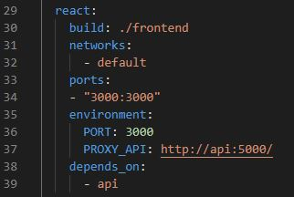

Puis, il faut également modifier le fichier **frontend/package.json**. Il faut remplacer la **ligne 31**, qui est actuellement adapté pour le lancement sous docker, par la commande ci-dessous :

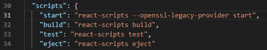

.. code-block:: bash

  > "start": "react-scripts start",

Suite à ces modifications, vous pouvez lancer le projet.

Pour cela, placez vous à la base du projet et lancez le backend :

.. code-block:: bash

  > docker-compose up --build

Puis, lancez le frontend en parallèle :

.. code-block:: bash

  > cd frontend
  > npm install
  > npm start

L’application web sera accessible sur votre localhost du port 3000 : http://localhost:3000/.

Et l'interface intéractive du backend est disponible sur le port 5000 : http://localhost:5000/docs/.

Visualisation et explication des pages
--------------------------------------

La page d'accueil contient l'affichage de tous les produits.

Sur cette page, il est possible de rechercher les produits que l'on souhaite voir par mots clé ou encore par catégorie. Il suffit d'écrire ce que l'on cherche dans la barre de recherche et/ou de choisir la catégorie voulue, puis de cliquer sur FILTRER.

Cette application contient une barre de navigation où vous pouvez vous connecter ou encore accéder à votre panier.

Lorsque vous appuyez sur Connexion, une page de connexion apparaît ou si vous ne posséder pas encore de compte, vous avez la possibilité de créer un compte.

La page d'inscription ressemble à l'image ci-dessous : 

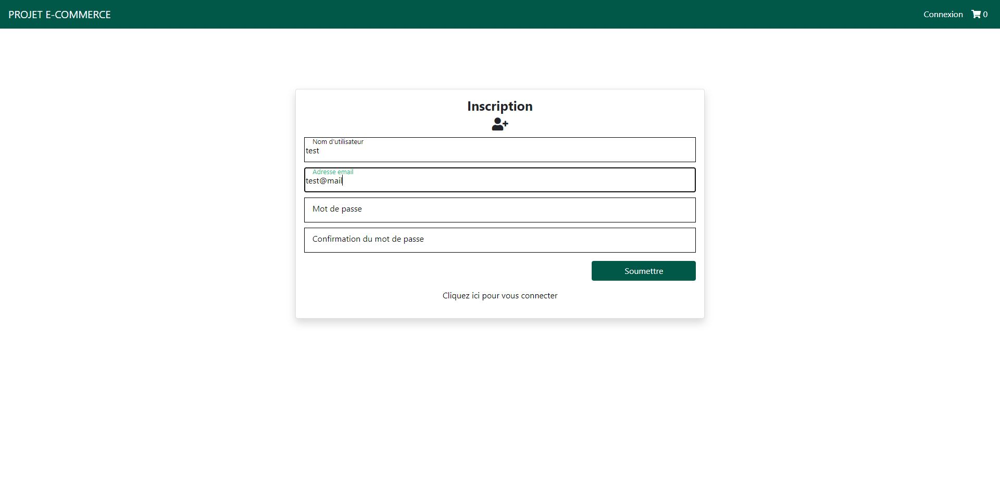

Quant à la page de connexion : 

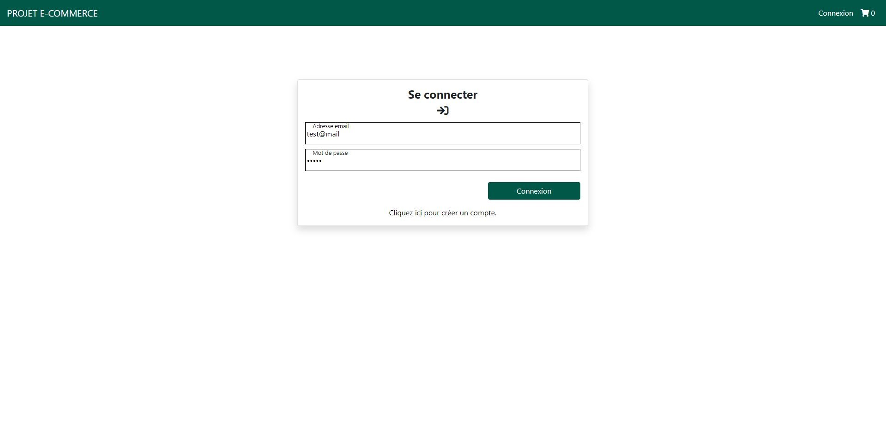
   
Puis, une fois connecté, le nom de l'utilisateur est affiché en haut à droite et plusieurs options sont désormais possibles et apparaîssent en dessous du nom de l'utilisateur.
Plus précisément, les options sont : 

- l'accès au information du compte
- la gestion des produits
- la liste des utilisateurs
- la déconnexion

Voici, un aperçu des options disponibles :

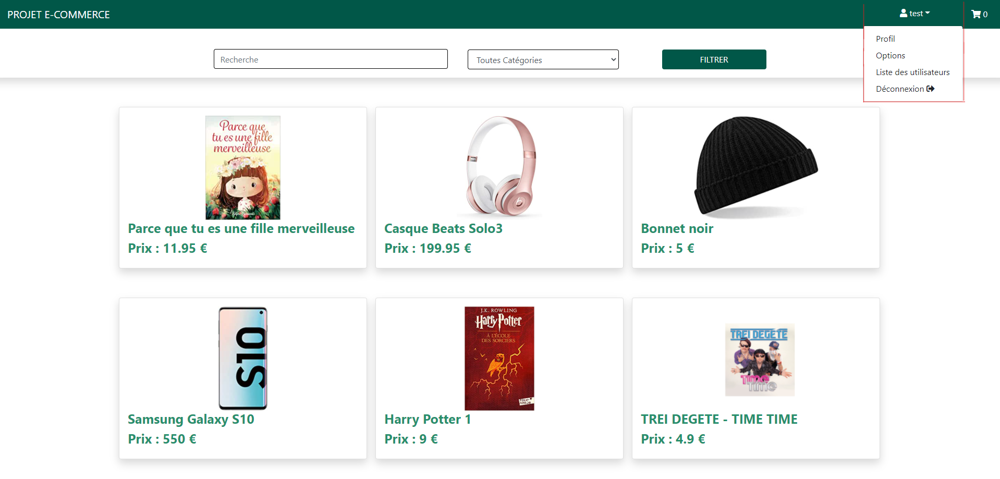

La première option est l'accès au profil du compte connecté. Cette option comprend la modification du compte. 

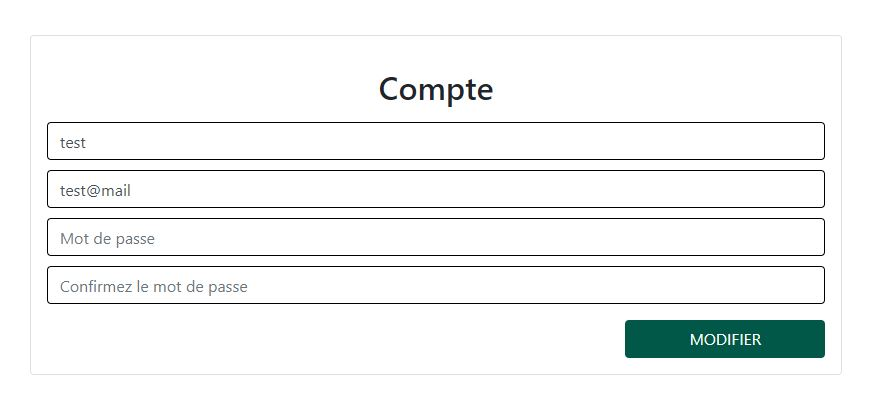
   
Puis, en étant connecté, vous pouvez gérer les produits, c'est à dire voir la liste de tous les produits, ajouter de nouveaux produits, les modifier ou encore les supprimer.

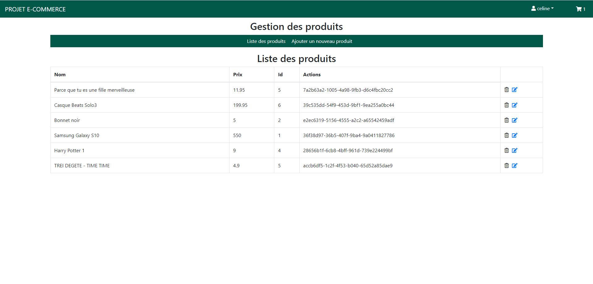
   
Sur cette page, il est possible alors possible d'accéder aux pages qui permettent d'ajouter un produit, en modifier un selon son identifiant ou encore le supprimer.

La page d'ajout de produit :

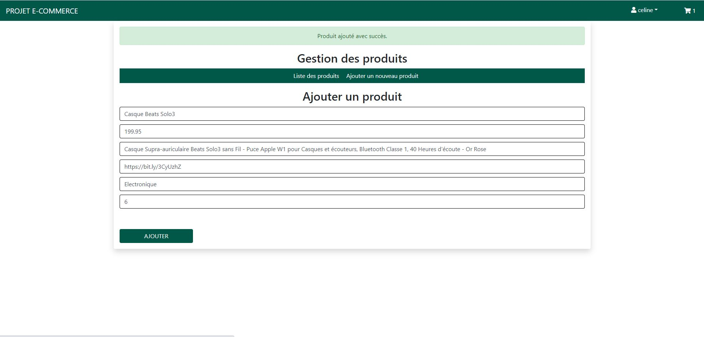
   
La page de modification de produit : 

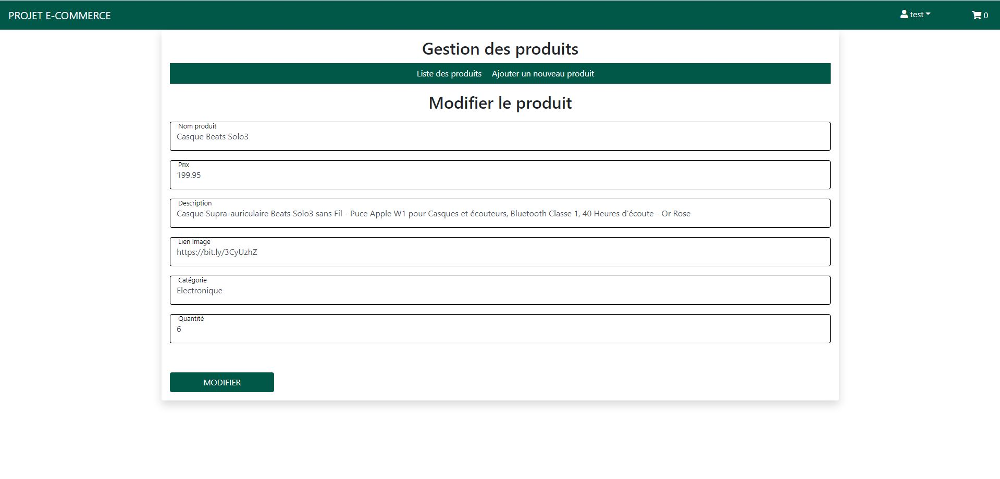
   
Ensuite, quant à la visualisation de la liste des utilisateurs, il est également possible d'en supprimer un. 

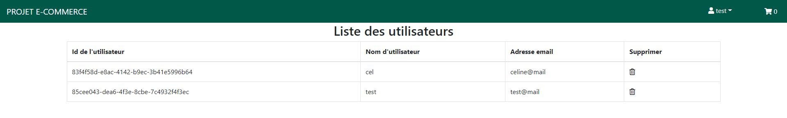
   
Ensuite, si vous vous placez sur la page d'accueil, il est possible de cliquer sur un produit qui vous intéresse. Cela vous redigigera vers la fiche descriptif du produit. Sur cette page, il vous sera possible d'ajouter le produit dans votre panier en choisissant la quantité souhaité.

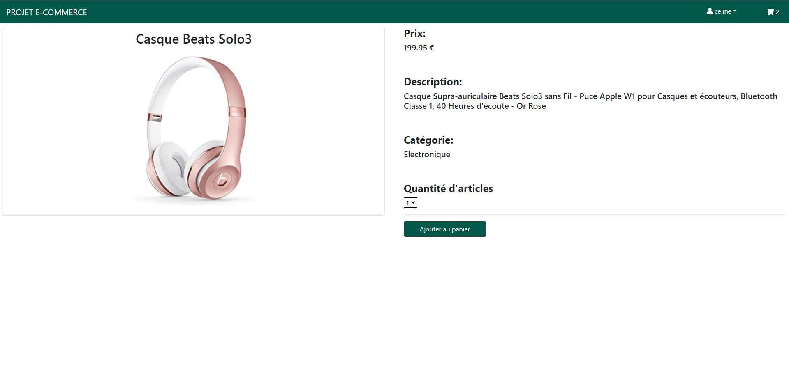
   
Enfin, nous avons également créer une page pour le panier. Cette page regroupe tous les articles ajoutés au panier et le prix selon la quantité choisis.
Voici un exemple : 

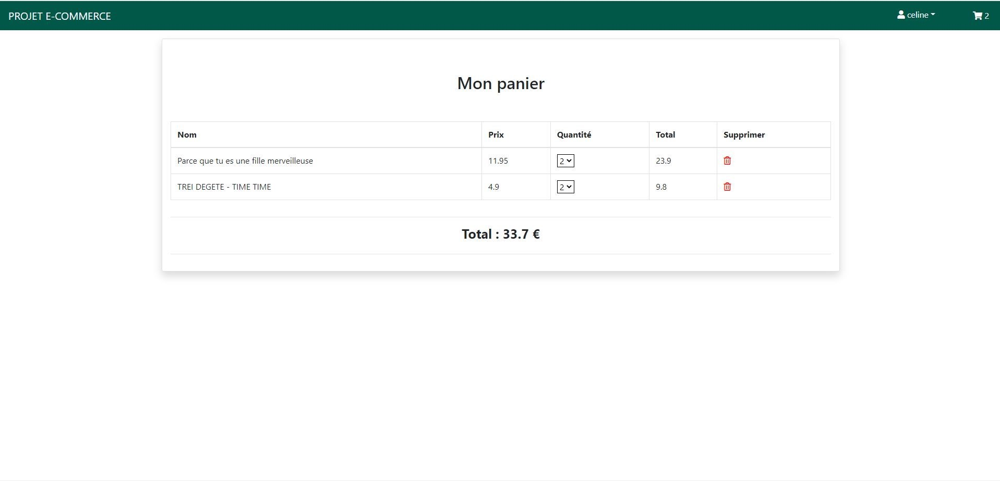
     
   
Amélioration
------------  
